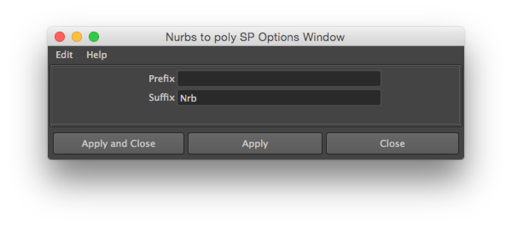

# nurbsToPolySp

version 0.0.1

- Select nurbsSurface or transform what have nurbsSurfaces before execute this function.
- Converted polygon's name will change to nurbsSurface's name.
- NurbsSurface's name will add prefix and add suffix.
- Converted polygon parent will nurbsSurface's parent.
- Converted polygon's polygonType to Quads.
- Converted polygon's tessellate will nurbsSurface's matchRenderTesselation.

## How to use

1. Download this python scripts.  
   [Download link](https://github.com/nrtkbb/nurbsToPolySp/archive/master.zip)
1. Unzip and rename folder.  
   `nurbsToPolySp-master.zip` → `nurbsToPolySp`
1. Move folder in your scripts directory.

  - Windows  
    `¥Users¥<username>¥Documents¥maya¥scripts`
  - OS X  
    `/Users/<username>/Library/Preferences/Autodesk/maya/scripts`

1. Enter this script in Maya ScriptEditor python tab.

    ```python
    from nurbsToPolySp.core import NurbsToPolySpOptionsWindow
    NurbsToPolySpOptionsWindow.showUI()
    ```



